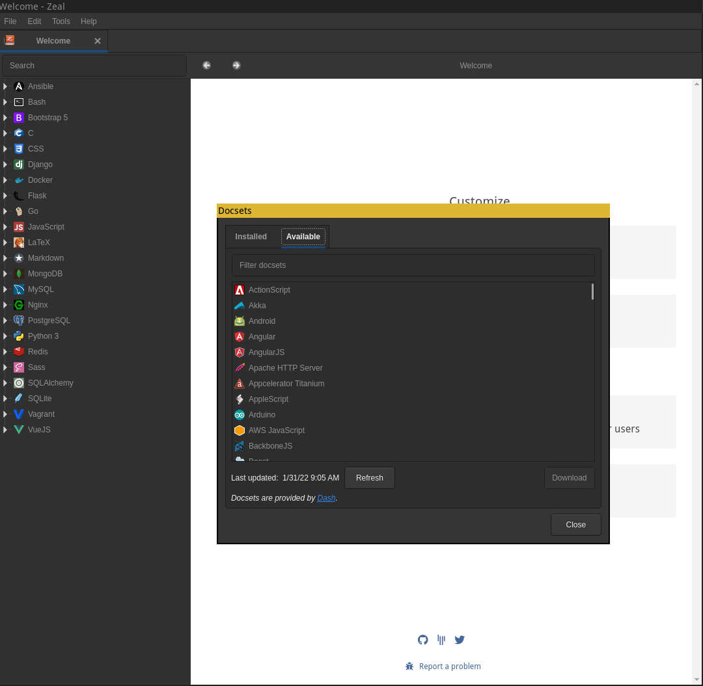
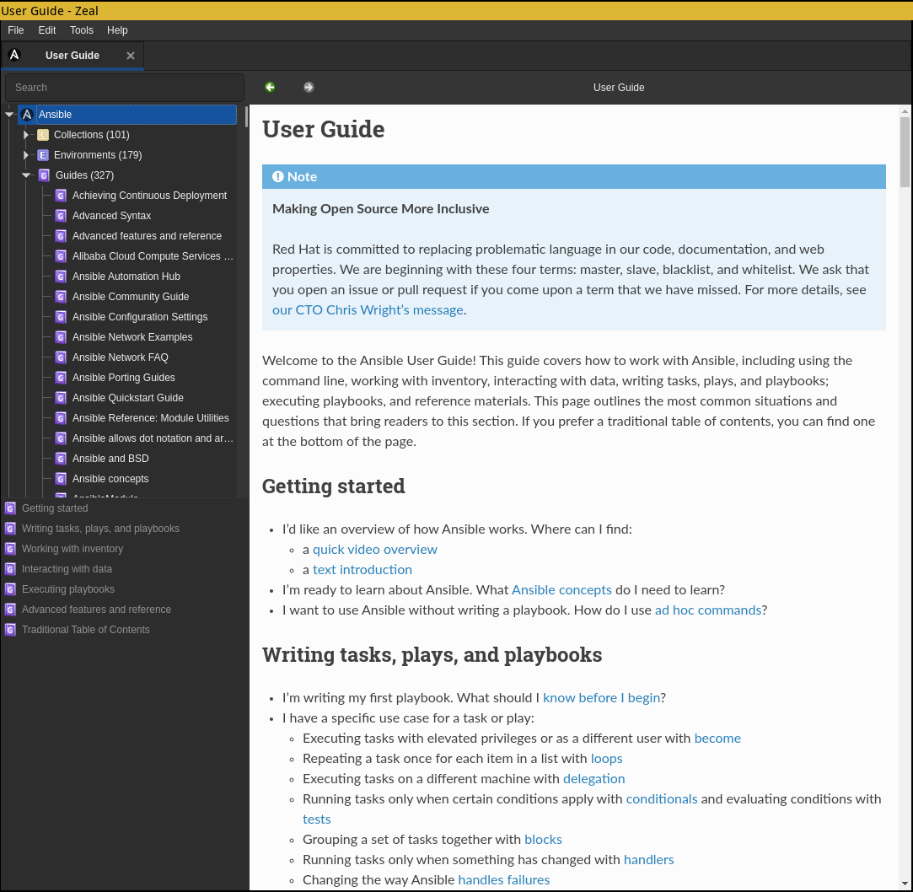

A veces uno sale de viaje, y bueno aprovecha el avión cuando son recorridos de 1h y más para ser productivos con nuestros portátiles. No obstante, seguro que nos ha pasado que justamente teníamos que acceder a una documentación del proyecto y por culpa de no tener Internet pues no podemos acceder a ella. Acabamos un poco frustrados al no poder terminar nuestra tarea, y terminamos o bien por cerrar la tapa del portátil o bien haciendo otra cosa.

<!-- truncate -->

Pues para evitar eso tenemos [Zeal](https://zealdocs.org), un visor de documentación fuera de línea de los proyectos más populares, entre ellos tenemos algunos como:
  - NGINX
  - Javascript
  - PHP
  - Python
  - Ruby
  - Ruby on rails
  - C
  - C++
  - Bash
  - MongoDB
  - ...

Este programa se distribuye con licencia GPLv3.

Para comenzar, tenemos que instalarlo primero:

En Fedora lo tenemos disponible en los repositorios oficiales:
```
sudo dnf install zeal
```

Gentoo Linux lo tenemos masked:
```
echo "app-doc/zeal ~amd64" | sudo tee /etc/portage/package.accept_keywords/zeal
sudo emerge -av zeal
``` 
Arch (AUR)
```
yay -S zeal
```

También está disponible para otros sistemas como Windows y Mac (OSX)

Después para instalar la documentación, hay que ir a Tools -> Docsets y en Available seleccionamos lo que queremos tener instalado:
 
Aquí os comparto unas screenshot:


