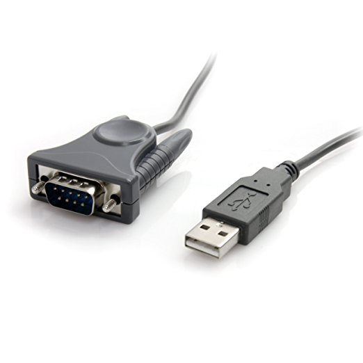
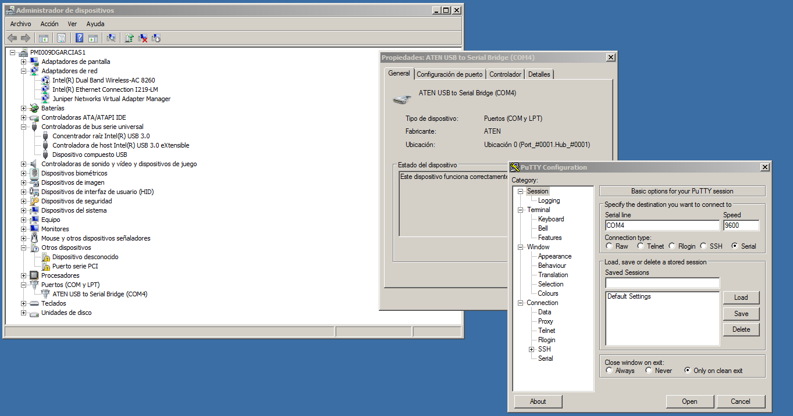

<!-- truncate -->

En el siguiente artículo, vamos a ver cómo podemos conectarnos mediante fuera de banda a dispositivos de red como puede ser un switch o un router desde Linux.

# ¿Qué es conexión fuera de banda?

Es un enlace entre un dispositivo (host) hacia el otro dispositivo que queramos acceder como un router o un switch haciendo uso de un cable especial como un RS-232, USB-MicroUSB, o un adaptador RS-232-USB. Esta conexión no requiere ningún tipo de direccionamiento IP y sólo puede accederse físicamente, a menos que tengamos un sistema de soporte de fuera de banda pero ya eso es otra historia.

# Tengo el adaptador, cable... ¿Cómo me conecto?

Para conectarnos necesitaremos un programa especial llamado "Emulador de terminal". Consiste en un software que nos permite ejecutar comandos en los dispositivos a los que queremos conectarnos. Este contiene una serie de parámetros como la velocidad, bit de paridad... que por regla general están determinados en el manual del dispositivo ya sea switch, router...

En los siguientes apartados veremos cómo conectarnos desde Linux, Windows.

## Linux
Tenemos una serie de programas en modo CLI como `minicom(1))`,  o también en modo GUI como `cutecom`, `putty(1)`.

Preferiblemente utilizo `screen(1)`, fácil, rápido y sencillo.

### Instalando screen

Lo tenemos disponible en la mayoría de distribuciones de Linux, si es que, no viene ya incluido por defecto.

#### Fedora 27

```
su -c "dnf install screen"
```

#### Archlinux

```
sudo pacman -S screen
```

#### Gentoo

```
sudo emerge -av screen
```

#### Debian, Ubuntu, Linux Mint...
```
sudo apt-get install screen
```

#### Código fuente

1. Descargar código fuente
2. Extraer
3. Instalar dependencias requeridas para la compilación
4. Configurar opciones y parámetros opcionales
5. Compilar
6. Instalar
7. Limpiar

##### Descargar código fuente
Obtenemos el código fuente desde [aquí](http://ftp.gnu.org/gnu/screen/screen-4.6.2.tar.gz?target=_blank), o bien mediante `wget(1)`. Posteriormente, descargamos la firma para verificar que el archivo no ha sufrido ninguna alteración, puedes hacerlo desde el siguiente [enlace](http://ftp.gnu.org/gnu/screen/screen-4.6.2.tar.gz.sig?target=_blank)

##### Extraer
Extraemos los archivos en un directorio, por ejemplo `/home/sincorchetes/screen`, y nos situamos en él.

##### Dependencias para la compilación
Instalamos todos aquellos archivos que se nos pide en el proceso de compilación. Generalmente suelen venir en un fichero README.

 * GCC
 * autoconf
 * make
 * binutils
 * automake
 * ncurses-devel

##### Configurar opciones
Según las instrucciones encontradas en el fichero INSTALL:
1. Ejecutar `./autogen.sh`
2. Establecer la configuración que queremos que tenga screen, incluyendo el directorio raíz dónde se instalará este software, en mi caso `/usr`:
```
./configure --prefix=/usr
```
3. Compilar el código

__NOTA: Puedes hacer uso de CFLAGS (instrucciones que contiene el procesador para llevar a cabo la compilación más rápida entre otras cosas), o la compilación paralela con -jN, dónde N equivale al número total de CPUs detectados en `/proc/cpuinfo`__

```
make
```

4. Instalar
```
make install clean
```

5. Ejecutar
```
screen
```

### Identificando el dispositivo
En Linux las conexiones seriales se encuentran en `/dev/ttySN`, sin embargo, al utilizar un adaptador USB se renombra a `/dev/ttyUSBN` siendo N el número de dispositivo detectado por orden de conexión.

Una vez que conectemos el adaptador USB, RS-232=USB, ejecutamos:
```dmesg```

Y en las últimas ĺíneas nos debería de aparecer el siguiente mensaje:
```
[13194.083292] usb 3-1: new full-speed USB device number 2 using xhci_hcd
[13194.232019] usb 3-1: New USB device found, idVendor=0557, idProduct=2008
[13194.232025] usb 3-1: New USB device strings: Mfr=1, Product=2, SerialNumber=0
[13194.232028] usb 3-1: Product: USB-Serial Controller D
[13194.232044] usb 3-1: Manufacturer: Prolific Technology Inc. 
[13195.175447] usbcore: registered new interface driver pl2303
[13195.175477] usbserial: USB Serial support registered for pl2303
[13195.175523] pl2303 3-1:1.0: pl2303 converter detected
[13195.204173] usb 3-1: pl2303 converter now attached to ttyUSB0
```

Ahí podemos ver cómo el dispositivo se encuentra en `/dev/ttyUSB0`

## Conectándonos al dispositivo
Abrimos una terminal:
```
$ screen /dev/ttyUSB0
```

Deberá salirte un mensaje como este de información previa al acceso al dispositivo en caso de que lo tuviese:
```
SAT FEB 17 06:53:48 : LANPOWER (108) info message:
+++ Power Supply #1 Present(0xc)!
+++ 48v Present(0x6)!
+++ Power Supply #1 Up(0xc)!
Successfully sent the I2C read message to NISUP!!

SAT FEB 17 06:53:58 : INTERFACE (6) info message:
+++  NIs are ready 

SAT FEB 17 06:54:28 : REMOTE_CONFIG (142) error message:
+++  DHCP Response not received in 30s. Failed!

SAT FEB 17 06:54:28 : REMOTE_CONFIG (142) info message:
+++ Remote Configuration Download cannot proceed.

login : 
```

## Windows
Para conectarnos desde Windows, tenemos software como PuTTY, TeraTerm...

1. Descargamos [PuTTY for Windows](https://www.chiark.greenend.org.uk/~sgtatham/putty/latest.html?target=_blank)
2. Instalamos 
3. Verificamos qué ID tiene el adaptador conectado accediendo a:
	* Panel de control -> Administrador de dispositivos -> Puertos (COM & LPT)
4. Una vez que lo sepamos, lanzamos PuTTY -> Serial -> "Serial Line escribimos": COM5

Como podemos ver en la siguiente imagen: 


# Troubleshooting
En este apartamos intentamos resolver algún que otro problema que nos pueda surgir en los diferentes sistemas.

## Linux
No se establece la conexión porque devulve:
```
/dev/ttyUSB0: Permission denied
```
Esto es debido a que la distribución que actualmente utilizamos gestiona los dispositivos seriales a través de un grupo como puede ser `dialout`. Para solucionar este problema:
```
# gpasswd -a USUARIO dialout
$ newgrp dialout
screen /dev/ttyUSB0
```

## Windows
El sistema no detecta el driver automáticamente, o no viene incluido con el cable.
Por lo general hay un driver genérico que podemos obtener a través del siguiente [enlace](http://www.prolific.com.tw/US/ShowProduct.aspx?p_id=225&pcid=41?target=_blank)

# Referencias
* Google 
* LPIC-I Ediciones ENI - Tercera edición
* [ArchLinux](https://wiki.archlinux.org/index.php/working_with_the_serial_console?target=_blank)

