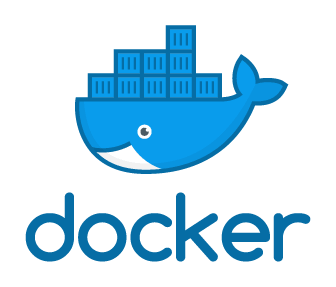

¿Te imaginas tener un sistema que te permitira probar aplicaciones sin tener que desplegar máquinas virtuales? Ese proceso tan engorroso de tener que estar descargando una .iso, esperar a que descargue, crear la máquina virtual, instalarla, actualizarla, buscar las dependencias... todo ese proceso engorroso que te afecta si lo único que quieres probar es tu aplicación.

<!-- truncate -->

Pues hay una alternativa, y esa alternativa es Docker. Docker es un gestor de despliegue de contenedores que te permite ejecutar con un tamaño muy reducido comparado con el de una máquina virtual tu aplicación en un par de segundos y de forma aislada de tu sistema haciendo uso de un servicio.




# Conceptos básicos
Vamos a explicar unos cuántos conceptos básicos, no te preocupes si hay algunas cosas que no entiendas, lo iré explicando en entregas posteriores.

## ¿Contenedor? ¿Qué es eso?
Un contenedor es la unidad de Docker, los contenedores son imágenes que se han desplegado y que están ocupando una serie de recursos de tu sistema para que puedan funcionar. Estos pueden contener software adicional que es añadido por un particular, empresa o proyecto que elabore esas imágenes.

## ¿Qué es una imagen?
Una imagen contiene un nombre único y un sistema base Linux mínimo para que pueda ejecutarse así mismo, ésta imagen utiliza un sistema de archivos llamado overlay2 que utiliza capas como mecanismo de control de cambios. Éstas capas se van añadiendo en el proceso de construcción de una imagen. Un ejemplo más cercano y no muy bien explicado, sería, instalar un sistema mínimo de alguna distribución de Linux (_da igual cual sea_), comprimimos todo el sistema con un .tar.gz y ya tendríamos nuestra imagen. Después, vas añadiendo más información en este .tar.gz, esto sería una capa nueva en una imagen de Docker.

## ¿Quién construye las imágenes?
Las imágenes suelen construirse por un particular, una empresa, una organización...o espera... ¡Tú también puedes hacerlo! más adelante explicaremos cómo lo puedes hacer.

## ¿Los contenedores se ejecutan de forma aislada?
Sí, los contenedores son como cajas de arena con las que puedes jugar sin afectar a tu propio sistema, ¡eso es lo bueno que tiene! Podemos desplegar un servidor Web NGINX con PHP incorporado y un sistema gestor de base de datos como es MariaDB ¡en segundos! ¡Nos dejamos de instalar esas engorrosas máquinas virtuales!

## ¿Se pueden definir límites de recursos del sistema por contenedor?
Sí, podemos decirle a los contenedores que no superen los recursos que le podemos asignar como es la memoria o el CPU entre otras cosas. También lo veremos más adelante.

## ¿Los contenedores son efímeros?
Sí, los contenedores pueden desaparecer y todo lo que haya dentro de elimina, por lo que si tu aplicación necesita guardar los archivos en algún sitito, es mejor que creas un volumen persistente.

## ¿Qué son los volúmenes persistentes?
Son como "particiones" de disco que podemos montar en nuestro contenedor o contenedores y permiten guardar archivos en ellos. Éstos se almacenan en un directorio del sistema.

## ¿Se puede usar un directorio del sistema como volumen persistente?
Sí, podemos usar un directorio actual cómo `/home/sincorchetes/Descargas` y montarlo como un volumen persistente en el contenedor, esto provocará que los archivos se guarden ahí.

## Si los contenedores se ejecutan de forma aislada, ¿Cómo podemos acceder a ellos?
Se puede acceder, al instalar Docker en tu sistema, se crea una nueva interfaz en modo puente llamada `docker0` y ademñas se crean unas rutas estáticas para llegar a esta red. Ésta interfaz de red suele tener una ip 172.17.0.1/16 y si ejecutamos un contenedor de Docker por defecto, éste contenedor se ejecutará utilizando esta red con la que podremos acceder a él si exponemos sus puertos. Es como cuando queremos acceder desde fuera al router de nuestra casa, exponemos el puerto 80 en el firewall y podemos acceder. Algo similar.

Cuando lo instalemos, ejecutamos `nmcli`, podemos ver como está en modo bridge por software:
```
docker0: connected to docker0
        "docker0"
        bridge, 02:42:BE:58:51:06, sw, mtu 1500
        inet4 172.17.0.1/16
        route4 172.17.0.0/16
        inet6 fe80::42:beff:fe58:5106/64
        route6 fe80::/64
        route6 ff00::/8
```

Y podemos ver la ruta estática que se crea con el comando `ip addr`:
```
default via 192.168.1.1 dev enp0s3 proto dhcp metric 100 
172.17.0.0/16 dev docker0 proto kernel scope link src 172.17.0.1 linkdown 
192.168.1.0/24 dev enp0s3 proto kernel scope link src 192.168.1.167 metric 100 
```

Por otro lado, podemos acceder a la shell del contenedor mediante comandos que veremos más adelante, por lo que tenemos acceso a la gestión interna del contenedor por consola y acceso a las aplicaciones expuestas por puertos.

## ¿Puertos? ¿Redes? ¿Pueden los contenedores tener otras redes?
Sí, los contenedores podemos exponerlos o no para poder acceder a las aplicaciones que se ejecutan dentro, es decir, si tienes un servidor Web NGINX escuchando las peticiones en el puerto 80 (_como es habitual_), le tienes que decir que acepte peticiones desde fuera de esta red, por lo que estamos exponiendo ese contenedor hacia fuera mediante unos puertos específicos. Esto lo explicaremos más adelante.

Y sí, en Docker hay tres tipos de red que se pueden utilizar, una interfaz puente, una red aislada, o una red interna, ¡se pueden hacer maravillas! Pero este contenido se me escapa de las manos.

## Pero... espera. ¿De dónde se sacan las imágenes?
Docker tiene la capacidad de buscar las imágenes dentro de un "Registry". Un "Registry" es un servidor o conjunto de servidores que nos ofertan múltiples imágenes y que también podemos interactuar con él (_o ellos_) como por ejemplo subir|eliminar|descargar las imágenes que hemos construido (_si tenemos permisos para hacerlo_). 

Las imágenes contienen unas etiquetas que podemos especificarle o no (_tags_) éstas identifican la versión mayor, menor o si es la última versión liberada. Cada vez que se añadan capas nuevas o se modifique el contenido de una imagen, ésta se actualizará con un etiqueta nueva. Si no especificamos la etiqueta nueva, la última imagen que haya en el "registry" local no tendrá la etiqueta `latest`, la imagen que se descarga sí que la contendrá.

Por defecto Docker conecta con DockerHub y consulta las imágenes ahí.

Entonces el proceso de despliegue de una imagen es de la siguiente manera:
<p style="text-align:center">
  
</p>

## Entonces... ¿Quiere decir que tenemos un Registry en nuestro sistema?
¡Sí! lo tendremos. Cuando descargamos la imagen, ésta se descarga por defecto en un directorio llamado `/var/lib/docker/`, cuando queramos desplegar una imagen la buscará aquí primero antes de tirar de otro registry.

## ¡Muy bien! ¿Podemos empezar?
¡Pues claro!

# Instalando Docker en CentOS 8
Primero quiero hacer una puntualización, Red Hat y las distribuciones como Fedora y CentOS están recomendando utilizar Podman. Podman es también un sistema de gestión de despliegues de contenedores muy parecido a Docker pero que utiliza un aislamiento mucho más estricto ya que dicen que el que Docker utiliza un servicio para gestionarlo todo es un agujero muy grande de seguridad y tiene razón, Docker tampoco es compatible con la nueva versión de cgroups. Los cgroups conocidos como "_Control Groups_" es una colección de procesos que están balanceados y están asociados con un conjunto de parámetros o límites. Estos grupos pueden ser jerárquicos refiriéndose a que cada grupo hereda los límites de su grupo padre. El núcleo accede a los múltiples controladores (también llamados subsistemas) a través de un interfaz cgroup; por ejemplo, el controlador de la "memoria" limita el uso de la memoria, "cpuacct" el uso de las cuentas de CPU...

Por lo visto, se reescribió la versión de CGroup en su segunda versión, y tanto CentOS 8 como Fedora usan la versión 2 que no está soportada por Docker. Para ello tenemos que añadir la siguiente línea en la línea del núcleo.

## Habilitando cgroup v1

Hacemos una copia de seguridad de este archivo:
```
# cp -va /etc/default/grub /etc/default/grub.bck.$(date +%d-%m-%y_%H_%M)
```
Editamos el archivo y añadimos al final de la variable `GRUB_CMDLINE_LINUX=`
```
systemd.unified_cgroup_hierarchy=0
```
Por ejemplo, en mi máquina lo tengo así:
```
GRUB_CMDLINE_LINUX="crashkernel=auto resume=/dev/mapper/cl_docker--server-swap rd.lvm.lv=cl_docker-server/root rd.lvm.lv=cl_docker-server/swap rhgb quiet systemd.unified_cgroup_hierarchy=0"
```
Regeneramos el fichero de configuración de arranque:

* Si usas UEFI, este estará en:
```
# grub2-mkconfig -o /boot/efi/EFI/centos/grub.cfg
```
* Si usas MBR:
```
# grub2-mkconfig -o /boot/grub2/grub.cfg
```
Reiniciamos el sistema.

## Instalando Docker-CE
CentOS no posee una versión de Docker por lo que hemos comentado más arriba. Siguiendo parte de la <a href="https://docs.docker.com/engine/install/centos/" target="blank">documentación oficial</a>, instalaremos la versión estable y comunitaria mediante los repositorios oficiales de Docker-CE (_Community Edition_).
```
# dnf config-manager --add-repo https://download.docker.com/linux/centos/docker-ce.repo
# dnf config-manager --enable docker-ce-stable
# dnf check-update
# dnf install docker-ce docker-ce-cli containerd.io --nobest
```
Como curiosidad podemos ver las múltiples versiones disponibles que podemos instalar:
```
$ dnf list docker-ce --showduplicates | sort -r
Installed Packages
docker-ce.x86_64            3:19.03.8-3.el7                    docker-ce-stable 
docker-ce.x86_64            3:19.03.7-3.el7                    docker-ce-stable 
docker-ce.x86_64            3:19.03.6-3.el7                    docker-ce-stable 
docker-ce.x86_64            3:19.03.5-3.el7                    docker-ce-stable 
docker-ce.x86_64            3:19.03.4-3.el7                    docker-ce-stable 
docker-ce.x86_64            3:19.03.3-3.el7                    docker-ce-stable 
docker-ce.x86_64            3:19.03.2-3.el7                    docker-ce-stable 
docker-ce.x86_64            3:19.03.1-3.el7                    docker-ce-stable 
...
```
Arrancando los servicios de Docker
```
# systemctl start docker.service
```
Revisamos que se está ejecutando correctamente:
```
$ sudo systemctl status docker.service

● docker.service - Docker Application Container Engine
   Loaded: loaded (/usr/lib/systemd/system/docker.service; disabled; vendor pre>
   Active: active (running) since Sun 2020-05-03 18:09:57 CEST; 3s ago
     Docs: https://docs.docker.com
 Main PID: 25800 (dockerd)
    Tasks: 17
   Memory: 49.6M
   CGroup: /system.slice/docker.service
           ├─25800 /usr/bin/dockerd -H fd://
           └─25809 containerd --config /var/run/docker/containerd/containerd.to>
```
Ya que vemos que funciona, lo dejamos habilitado al arranque de la máquina:
```
$ systemctl enable docker.service
```

Probamos a correr un contenedor `hello-world` de Docker:
```
 # docker run hello-world
```
 Como explicamos anteriormente, como la imagen `hello-world` no está en nuestro registry local, va a buscarla a Docker Hub por defecto, la descargará y luego creará el contenedor. Esta es la salida correcta:
 ```
 Unable to find image 'hello-world:latest' locally
latest: Pulling from library/hello-world
0e03bdcc26d7: Pull complete 
Digest: sha256:8e3114318a995a1ee497790535e7b88365222a21771ae7e53687ad76563e8e76
Status: Downloaded newer image for hello-world:latest

Hello from Docker!
This message shows that your installation appears to be working correctly.

To generate this message, Docker took the following steps:
 1. The Docker client contacted the Docker daemon.
 2. The Docker daemon pulled the "hello-world" image from the Docker Hub.
    (amd64)
 3. The Docker daemon created a new container from that image which runs the
    executable that produces the output you are currently reading.
 4. The Docker daemon streamed that output to the Docker client, which sent it
    to your terminal.

To try something more ambitious, you can run an Ubuntu container with:
 $ docker run -it ubuntu bash

Share images, automate workflows, and more with a free Docker ID:
 https://hub.docker.com/

For more examples and ideas, visit:
 https://docs.docker.com/get-started/
 ```

¡Con esto ya habremos acabado!

__NOTA:__ _Si quieres simplificar el proceso de administración en un servidor de pruebas, puedes añadir tu usuario al grupo docker para que no solicite privilegios, pero esto se considera un fallo de seguridad ya que puedes escalar privilegios. Así que cuidado. `# usermod -aG docker your-user`

## Comandos de Docker
Si ejecutamos el comando `docker` a secas, veremos una lista enorme de opciones que podemos utilizar. Por un lado tenemos las opciones de gestión:
```
  builder     Manage builds
  config      Manage Docker configs
  container   Manage containers
  context     Manage contexts
  engine      Manage the docker engine
  image       Manage images
  network     Manage networks
  node        Manage Swarm nodes
  plugin      Manage plugins
  secret      Manage Docker secrets
  service     Manage services
  stack       Manage Docker stacks
  swarm       Manage Swarm
  system      Manage Docker
  trust       Manage trust on Docker images
  volume      Manage volumes
```

Y por otro lado, tenemos comandos:
```
  attach      Attach local standard input, output, and error streams to a running container
  build       Build an image from a Dockerfile
  commit      Create a new image from a container's changes
  cp          Copy files/folders between a container and the local filesystem
  create      Create a new container
  deploy      Deploy a new stack or update an existing stack
  diff        Inspect changes to files or directories on a container's filesystem
  events      Get real time events from the server
  exec        Run a command in a running container
  export      Export a container's filesystem as a tar archive
  history     Show the history of an image
  images      List images
  import      Import the contents from a tarball to create a filesystem image
  info        Display system-wide information
  inspect     Return low-level information on Docker objects
  kill        Kill one or more running containers
  load        Load an image from a tar archive or STDIN
  login       Log in to a Docker registry
  logout      Log out from a Docker registry
  logs        Fetch the logs of a container
  pause       Pause all processes within one or more containers
  port        List port mappings or a specific mapping for the container
  ps          List containers
  pull        Pull an image or a repository from a registry
  push        Push an image or a repository to a registry
  rename      Rename a container
  restart     Restart one or more containers
  rm          Remove one or more containers
  rmi         Remove one or more images
  run         Run a command in a new container
  save        Save one or more images to a tar archive (streamed to STDOUT by default)
  search      Search the Docker Hub for images
  start       Start one or more stopped containers
  stats       Display a live stream of container(s) resource usage statistics
  stop        Stop one or more running containers
  tag         Create a tag TARGET_IMAGE that refers to SOURCE_IMAGE
  top         Display the running processes of a container
  unpause     Unpause all processes within one or more containers
  update      Update configuration of one or more containers
  version     Show the Docker version information
  wait        Block until one or more containers stop, then print their exit codes
```

En los siguientes tutoriales veremos como utilizar los comandos de gestión de Docker.
